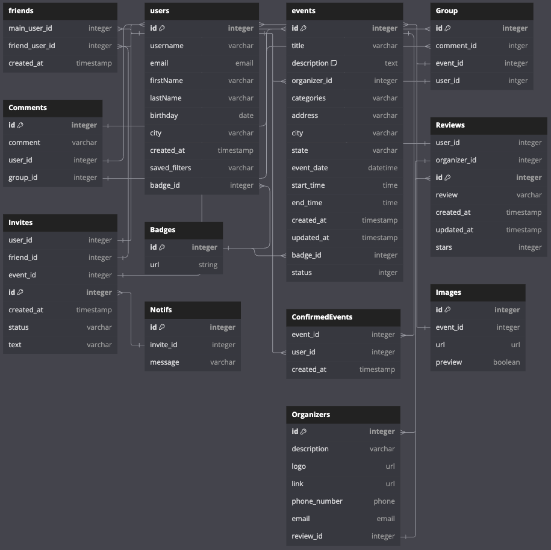

## SAGE API Docs



* Base URL: '/'

## All routes that require Authentication

All endpoints that require a user to be logged in
- Notifications
- Reviews
- Create Group
- User DashBoard
- Growth -- Bonus
All endpoints that require a current user to be logged in.

* Request: endpoints that require authentication
* Error Response: Require authentication
  * Status Code: 401
  * Headers:
    * Content-Type: application/json
  * Body:

    ```json
    {
      "message": "Authentication required"
    }
    ```


* Request: endpoints that require proper authorization
* Error Response: Require proper authorization
  * Status Code: 403
  * Headers:
    * Content-Type: application/json
  * Body:

    ```json
    {
      "message": "Forbidden"
    }
    ```

## Get Current User

 - Require Auth: False

 - Request
    - Method: GET
    - Route Path: "/session"
    - Body: ?
 - Successful Response
    - status: 200
    - Headers
      - Content-Type: application/json --- *Sets to this when/if you are returning a JSON response using jsonify()

    - Body
    ```json
      {
         "user": {
            "id": 0,
            "username": "'VolunteerLyfe'",
            "email": "'green4lyfe@planet.com'",
            "firstName": "'Susan'",
            "lastName":"'Markcul'",
            "address": "1322 Money Dr",
            "city": "'someCity'",
            "state": "someState",
            "create_at": "TimeStamp",
            /*
            PREFERENCES COMING SOON
            "saved_filters":["Filter1", "Filter2"],
            */
            "badges": [1, 3, 22]
         }
      }

* Successful Response when there is no logged in user.
  * Status Code: 200
  * Headers:
    * Content-Type: application/json
  * Body:

    ```json
    {
      "user": "None"
    }
    ```
### Log In a User

Logs in a current user with valid credentials and returns the current user's
information.

* Require Authentication: false
* Request
  * Method: POST
  * Route path: /session
  * Headers:
    * Content-Type: application/json
  * Body:

    ```json
    {
      "credential": "green4lyfe@planet.com",
      "password": "secret password"
    }
    ```

* Successful Response
  * Status Code: 200
  * Headers:
    * Content-Type: application/json
  * Body:

    ```json
    {
      "user": {
        "id": 1,
        "first_name": "Susan",
        "last_name": "Markcul",
        "email": "green4lyfe@planet.com",
        "username": "Volunteer4Lyfe",
        "city": "someCity",
        "state": "someState"
      }
    }
    ```

* Error Response: Invalid credentials
  * Status Code: 401
  * Headers:
    * Content-Type: application/json
  * Body:

    ```json
    {
      "message": "Invalid credentials"
    }
    ```

* Error response: Body validation errors
  * Status Code: 400
  * Headers:
    * Content-Type: application/json
  * Body:

    ```json
    {
      "message": "Bad Request",
      "errors": {
        "credential": "Email or username is required",
        "password": "Password is required",
        "city": "City is required",
        "state": "State is required",
      }
    }
    ```
 ### Sign Up a User

Creates a new user, logs them in as the current user, and returns the current
user's information.

* Require Authentication: false
* Request
  * Method: POST
  * Route path: /users
  * Headers:
    * Content-Type: application/json
  * Body:

    ```json
    {
      "first_name": "John",
      "last_name": "Smith",
      "email": "john.smith@gmail.com",
      "username": "JohnSmith",
      "password": "secret password",
      "address": "1322 Money Dr",
      "city": "'someCity'",
      "state": "someState"
    }
    ```

* Successful Response
  * Status Code: 201
  * Headers:
    * Content-Type: application/json
  * Body:

    ```json
    {
      "user": {
        "id": 1,
        "first_name": "John",
        "last_name": "Smith",
        "email": "john.smith@gmail.com",
        "username": "JohnSmith",
        "city": "'someCity'",
        "state": "someState"
      }
    }
    ```

* Error response: User already exists with the specified email or username
  * Status Code: 500
  * Headers:
    * Content-Type: application/json
  * Body:

    ```json
    {
      "message": "User already exists",
      "errors": {
        "email": "User with that email already exists",
        "username": "User with that username already exists"
      }
    }
    ```

* Error response: Body validation errors
  * Status Code: 400
  * Headers:
    * Content-Type: application/json
  * Body:

    ```json
    {
      "message": "Bad Request",
      "errors": {
        "email": "Invalid email",
        "username": "Username is required",
        "first_name": "First Name is required",
        "last_name": "Last Name is required",
        "city": "City is required",
        "state": "State is required"
      }
    }
    ```

### Get all Events

Returns all the Events.

* Require Authentication: false
* Request
  * Method: GET
  * Route path: /events
  * Body: none

* Successful Response
  * Status Code: 200
  * Headers:
    * Content-Type: application/json
  * Body:

    ```json
    {
      "Events": [{

              "id": 1,
              "title": "Help Us",
              "description": "Helping people",
              "categories": ["Outdoor", "LGBT"],
              "address": "1233 Do Good St.",
              "'city'": "Great City",
              "state": "California",
              "event_date": "December 25, 2024",
              "start_time": "9:00:00 EST",
              "end_time": "13:30:00 EST",
              "created_at": "TimeStamp",
              "updated_at": "TimeStamp",
              "badge_id": 12,
              "status" : 1
        }
      ]
    }
    ```
### Get all My Events by the Current User

Returns all the events accepted by the current user.

* Require Authentication: true
* Request
  * Method: GET
  * Route path: /:UserId/events
  * Body: none

* Successful Response
  * Status Code: 200
  * Headers:
    * Content-Type: application/json
  * Body:

    ```json
    {
      "Events": [
        {
              "id": 1,
              "title": "Help Us",
              "description": "Helping people",
              "categories": ["Outdoor", "LGBT"],
              "address": "1233 Do Good St.",
              "'city'": "Great City",
              "state": "California",
              "event_date": "December 25, 2024",
              "start_time": "9:00:00 EST",
              "end_time": "13:30:00 EST",
              "created_at": "TimeStamp",
              "updated_at": "TimeStamp",
              "badge_id": 12,
              "status" : 1
        }
      ]
    }
    ```
### Get details of a Event from an id

Returns the details of a event specified by its id.

* Require Authentication: false
* Request
  * Method: GET
  * Route path: /events/:id
  * Body: none

* Successful Response
  * Status Code: 200
  * Headers:
    * Content-Type: application/json
  * Body:

    ```json
    {
      "id": 1,
      "title": "Help Us",
      "description": "Helping people",
      "categories": ["Outdoor", "LGBT"],
      "address": "1233 Do Good St.",
      "'city'": "Great City",
      "state": "California",
      "event_date": "December 25, 2024",
      "start_time": "9:00:00 EST",
      "end_time": "13:30:00 EST",
      "created_at": "TimeStamp",
      "updated_at": "TimeStamp",
      "badge_id": 12,
      "status" : 1,
      "EventImages": [
        {
          "id": 1,
          "url": "image url",
          "preview": true
        },
        {
          "id": 2,
          "url": "image url",
          "preview": false
        }
      ],
       "Organizer": {
        "id": 1,
        "description": "Some stuff about the Organizer",
        "name": "the Organizer",
        "logo": "URL",
        "link": "URL",
        "phone_number": 801-555-5555,
        "email": "someemail@someplace.org"
      }
    }
    ```

* Error response: Couldn't find a Event with the specified id
  * Status Code: 404
  * Headers:
    * Content-Type: application/json
  * Body:

    ```json
    {
      "message": "Event couldn't be found"
    }
    ```

### Create an Invite

Creates and returns a new Invites.

* Require Authentication: true
* Request
  * Method: POST
  * Route path: groups/:grouId/invites
  * Headers:
    * Content-Type: application/json
  * Body:

    ```json
    {
      "id": 1,
      "user_id": 1,
      "friend_id": 2,
      "event_id": 1,
      "groupId": 1,
      "created_at": "TimeStamp",
      "status": 1
    }
    ```

* Successful Response
  * Status Code: 201
  * Headers:
    * Content-Type: application/json
  * Body:

    ```json
    {
      "id": 1,
      "user_id": 1,
      "friend_id": 2,
      "event_id": 1,
      "groupId": 1,
      "created_at": "TimeStamp",
      "status": 1
    }
    ```

* Error Response: Body validation errors
  * Status Code: 400
  * Headers:
    * Content-Type: application/json
  * Body:

    ```json
    {
      "message": "Bad Request",
      "errors": {
        "friend_id": "Friend cannot be found",
        "event_id": "Event cannot be found",
      }
    }
    ```
### Edit a Invite

Updates and returns an existing Invite.

* Require Authentication: true
* Require proper authorization: Invite must belong to the current user
* Request
  * Method: PUT
  * Route path: /groups/:groupId/invites
  * Headers:
    * Content-Type: application/json
  * Body:

    ```json
    {
      "id": 1,
      "user_id": 1,
      "groupId": 1,
      "created_at": "TimeStamp",
      "status": 1
    }
    ```

* Successful Response
  * Status Code: 200
  * Headers:
    * Content-Type: application/json
  * Body:

    ```json
    {
      "id": 1,
      "user_id": 1,
      "groupId": 1,
      "created_at": "TimeStamp",
      "status": 0
    }
    ```

* Error Response: Body validation errors
  * Status Code: 400
  * Headers:
    * Content-Type: application/json
  * Body:

    ```json
    {
      "message": "You must be friends to invite user",
      "errors": {
        "friends_status": "Need to be friends"
      }
    }
    ```

* Error response: Couldn't find a Group with the specified id
  * Status Code: 404
  * Headers:
    * Content-Type: application/json
  * Body:

    ```json
    {
      "message": "Invite couldn't be found"
    }
    ```
## Delete a Invite

Deletes an existing Invite specific "friend".

* Require Authentication: true
* Require proper authorization: Invite must belong to the current user
* Request
  * Method: DELETE
  * Route path: groups/:groupId/invites/:inviteId
  * Body: none

* Successful Response
  * Status Code: 200
  * Headers:
    * Content-Type: application/json
  * Body:

    ```json
    {
      "message": "Successfully deleted"
    }
    ```

* Error response: Couldn't find a Spot with the specified id
  * Status Code: 404
  * Headers:
    * Content-Type: application/json
  * Body:

    ```json
    {
      "message": "Invite couldn't be found"
    }
    ```

## Confirmed Events

### Get all of the Current User's Confirmed Events

Return all the Confirmed Events that the current user has made.

* Require Authentication: true
* Request
  * Method: GET
  * Route path: /:userId/confirm
  * Body: none

* Successful Response
  * Status Code: 200
  * Headers:
    * Content-Type: application/json
  * Body:

    ```json
    {
      "ConfirmedEvents": [
        {
          "id": 1,
          "event_id": 1,
          "Event": {
            "id": 1,
            "title": "Help Us",
            "description": "Helping people",
            "organizer_id": 1,
            "categories": ["Outdoor", "LGBT"],
            "address": "1233 Do Good St.",
            "city": "Great City",
            "state": "California",
            "event_date": "December 25, 2024",
            "created_at": "TimeStamp",
            "updated_at": "TimeStamp",
            "badge_id": 12,
            "review_id": [11, 10, 5],
            "status" : 1,
            "preview_Img": "URL"
          },
          "user_id": 2,
          "start_time": "2021-11-19",
          "end_time": "2021-11-20",
          "event_date": "2021-11-19",
          "created_at": "2021-11-19 20:39:36",
          "updated_at": "2021-11-19 20:39:36"
        }
      ]
    }
    ```

### Get all Attendees for a event based on the event's id

Return all the attendees for a event specified by id.

* Require Authentication: true
* Request
  * Method: GET
  * Route path: /confirm/:eventId
  * Body: none

* Successful Response:
  * Status Code: 200
  * Headers:
    * Content-Type: application/json
  * Body:

    ```json
    {
      "Attendees": [
        {
          "user_id": 1,
          "first_name": "FirstName",
          "last_name": "LastName"
        }
      ]
    }
    ```

* Error response: Couldn't find a Event with the specified id
  * Status Code: 404
  * Headers:
    * Content-Type: application/json
  * Body:

    ```json
    {
      "message": "Event couldn't be found"
    }
    ```


## **Friends API Documentation**

---

### **Get All Friends of the Current User**

Returns a list of all the current user's friends. Users who have attended the same event together before will automatically be considered friends.

* **Require Authentication**: true
* **Request**
  * **Method**: GET
  * **Route path**: `/friends`
  * **Body**: none

* **Successful Response**
  * **Status Code**: 200
  * **Headers**:
    * `Content-Type: application/json`
  * **Body**:
    ```json
    {
      "Friends": [
        {
          "id": 1,
          "first_name": "John",
          "username": "johndoe",
          "profile_image_url": "https://image-url.com/profile1.jpg"
        },
        {
          "id": 2,
          "first_name": "Jane",
          "username": "janesmith",
          "profile_image_url": "https://image-url.com/profile2.jpg"
        }
      ]
    }
    ```

* **Error Response: No friends found**
  * **Status Code**: 404
  * **Headers**:
    * `Content-Type: application/json`
  * **Body**:
    ```json
    {
      "message": "No friends could be found"
    }
    ```

---

### **Get Limited Details of a Specific Friend**

Returns limited information about a specific friend, including their first name, username, profile image, and a list of past events attended together.

* **Require Authentication**: true
* **Request**
  * **Method**: GET
  * **Route path**: `/friends/:friendId`
  * **Body**: none

* **Successful Response**
  * **Status Code**: 200
  * **Headers**:
    * `Content-Type: application/json`
  * **Body**:
    ```json
    {
      "Friend": {
        "firstName": "John",
        "username": "johndoe",
        "profileImageUrl": "https://image-url.com/profile1.jpg",
        "eventsAttendedTogether": [
          {
            "eventId": 1,
            "eventName": "Beach Cleanup",
            "eventDate": "2024-12-01"
          },
          {
            "eventId": 2,
            "eventName": "Food Bank Volunteering",
            "eventDate": "2024-11-15"
          }
        ]
      }
    }
    ```

* **Error Response: Friend not found**
  * **Status Code**: 404
  * **Headers**:
    * `Content-Type: application/json`
  * **Body**:
    ```json
    {
      "message": "Friend not found"
    }
    ```

---

### **Get Events Attended with a Friend**

Returns a list of all events that the current user and a specific friend have attended together.

* **Require Authentication**: true
* **Request**
  * **Method**: GET
  * **Route path**: `/friends/:friendId/events`
  * **Body**: none

* **Successful Response**
  * **Status Code**: 200
  * **Headers**:
    * `Content-Type: application/json`
  * **Body**:
    ```json
    {
      "EventsAttendedTogether": [
        {
          "eventId": 1,
          "eventName": "Beach Cleanup",
          "eventDate": "2024-12-01",
          "organizer": "Save The Beaches Org",
          "location": "Santa Monica Beach"
        },
        {
          "eventId": 2,
          "eventName": "Food Bank Volunteering",
          "eventDate": "2024-11-15",
          "organizer": "Local Food Bank",
          "location": "Community Center, San Francisco"
        }
      ]
    }
    ```

* **Error Response: No shared events found**
  * **Status Code**: 404
  * **Headers**:
    * `Content-Type: application/json`
  * **Body**:
    ```json
    {
      "message": "No shared events found"
    }
    ```

---

## **Groups API Documentation**

---

### **Get All Groups of the Current User**

Returns a list of all the groups the current user is a part of.

* **Require Authentication**: true
* **Request**
  * **Method**: GET
  * **Route path**: `/groups`
  * **Body**: none

* **Successful Response**
  * **Status Code**: 200
  * **Headers**:
    * `Content-Type: application/json`
  * **Body**:
    ```json
    {
      "Groups": [
        {
          "id": 1,
          "eventId": 6
          "ownerId": 2
        },
        {
          "id": 1,
          "eventId": 6
          "ownerId": 2
        },
      ]
    }
    ```

* **Error Response: No groups found**
  * **Status Code**: 404
  * **Headers**:
    * `Content-Type: application/json`
  * **Body**:
    ```json
    {
      "message": "No groups could be found"
    }
    ```

---

### **Get Details of a Specific Group**

Returns detailed information about a specific group, including the name, description, image, and member details.

* **Require Authentication**: true
* **Request**
  * **Method**: GET
  * **Route path**: `/groups/:groupId`
  * **Body**: none

* **Successful Response**
  * **Status Code**: 200
  * **Headers**:
    * `Content-Type: application/json`
  * **Body**:
    ```json
    {
      {
        "id": 1,
        "eventId": 6
        "ownerId": 2
      }
    }
    ```

* **Error Response: Group not found**
  * **Status Code**: 404
  * **Headers**:
    * `Content-Type: application/json`
  * **Body**:
    ```json
    {
      "message": "Group not found"
    }
    ```

---

### **Create a New Group**

Creates a new group and returns the newly created group's information.

* **Require Authentication**: true
* **Request**
  * **Method**: POST
  * **Route path**: `/groups`
  * **Headers**:
    * `Content-Type: application/json`
  * **Body**:
    ```json
        {
          "eventId": 6
        },
    ```

* **Successful Response**
  * **Status Code**: 201
  * **Headers**:
    * `Content-Type: application/json`
  * **Body**:
    ```json
    {
      {
        "id": 1,
        "eventId": 6
        "ownerId": 2
      }
    }
    ```

* **Error Response: Validation errors**
  * **Status Code**: 400
  * **Headers**:
    * `Content-Type: application/json`
  * **Body**:
    ```json
    {
      "message": "Bad Request",
      "errors": {
        "name": "Event choice is required",
        "description": "Event choice is required"
      }
    }
    ```

---

### **Delete a Group**

Deletes a group. Only the creator of the group is allowed to delete it.

* **Require Authentication**: true
* **Require Proper Authorization**: User must be the creator of the group
* **Request**
  * **Method**: DELETE
  * **Route path**: `/groups/:groupId`
  * **Body**: none

* **Successful Response**
  * **Status Code**: 200
  * **Headers**:
    * `Content-Type: application/json`
  * **Body**:
    ```json
    {
      "message": "Successfully deleted group"
    }
    ```

* **Error Response: Group not found**
  * **Status Code**: 404
  * **Headers**:
    * `Content-Type: application/json`
  * **Body**:
    ```json
    {
      "message": "Group not found"
    }
    ```

---

### **Get All Members of a Group**

Returns a list of all members of a specific group.

* **Require Authentication**: true
* **Request**
  * **Method**: GET
  * **Route path**: `/groups/:groupId/members`
  * **Body**: none

* **Successful Response**
  * **Status Code**: 200
  * **Headers**:
    * `Content-Type: application/json`
  * **Body**:
    ```json
    {
      "Members": [
         {
            "id": 0,
            "username": "'VolunteerLyfe'",
            "email": "'green4lyfe@planet.com'",
            "firstName": "'Susan'",
            "lastName":"'Markcul'",
            "birthday": "'November 16th, 1994'",
            "city": "'somecity'",
            "create_at": "timstamp",
            "saved_filters":["Filter1", "Filter2"],
            "badge_id": [1, 3, 22]
         },
        {
            "id": 3,
            "username": "'VolunteerLyfe1'",
            "email": "'gre3en4lyfe@planet.com'",
            "firstName": "'Suz'",
            "lastName":"'Mark'",
            "birthday": "'November 16th, 1993'",
            "city": "'somewherecity'",
            "create_at": "timestamp",
            "saved_filters":["Filter1", "Filter2"],
            "badge_id": [1, 3, 22]
        }
      ]
    }
    ```

* **Error Response: Group not found**
  * **Status Code**: 404
  * **Headers**:
    * `Content-Type: application/json`
  * **Body**:
    ```json
    {
      "message": "Group not found"
    }
    ```

---
